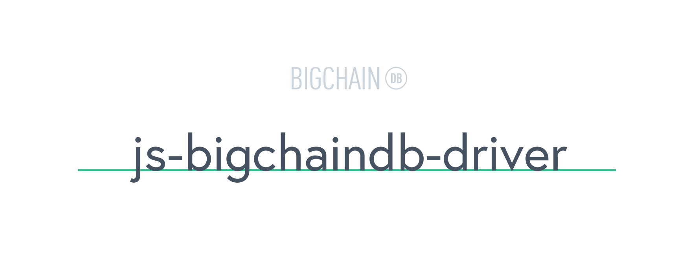

<!---
Copyright BigchainDB GmbH and BigchainDB contributors
SPDX-License-Identifier: (Apache-2.0 AND CC-BY-4.0)
Code is Apache-2.0 and docs are CC-BY-4.0
--->

# [](https://www.bigchaindb.com)

> Official JavaScript driver for [BigchainDB](https://github.com/bigchaindb/bigchaindb) to create transactions in Node.js and the browser.

[](https://gitter.im/bigchaindb/js-bigchaindb-driver?utm_source=badge&utm_medium=badge&utm_campaign=pr-badge&utm_content=badge)
[](https://www.npmjs.com/package/bigchaindb-driver)
[](https://codecov.io/gh/bigchaindb/js-bigchaindb-driver)
[](https://github.com/ascribe/javascript)
[](https://travis-ci.com/bigchaindb/js-bigchaindb-driver)
[](https://greenkeeper.io/)

- [Main Documentation](https://docs.bigchaindb.com/projects/js-driver/en/latest/usage.html)
- [Driver API reference](API.md)

## Compatibility

| BigchainDB Server | BigchainDB JavaScript Driver |
| ----------------- |------------------------------|
| `0.10`            | `0.1.x`                      |
| `1.0.0`           | `0.3.x`                      |
| `1.3.x`           | `3.x.x`                      |
| `>= 2.0.0`        | `4.x.x`                      |

## Breaking changes

- **Version 4.0** of BigchainDB JavaScript Driver makes the driver compatible with BigchainDB 2.0. There are new functions for sending off transactions along with other changes. Check [older versions](https://docs.bigchaindb.com/projects/js-driver/en/latest/readme.html#features)
- **Version 3.2** of BigchainDB JavaScript Driver introduces a new way of creating transfer transactions. Check [older versions](https://docs.bigchaindb.com/projects/js-driver/en/latest/readme.html#features)

## Table of Contents

  - [Installation and Usage](#installation-and-usage)
     - [Example: Create a transaction](#example-create-a-transaction)
     - [Browser usage](#browser-usage)
  - [BigchainDB Documentation](#bigchaindb-documentation)
  - [Speed Optimizations](#speed-optimizations)
  - [Development](#development)
  - [Release Process](#release-process)
  - [Authors](#authors)
  - [Licenses](#licenses)

---

## Installation and Usage

```bash
npm install bigchaindb-driver
```

```js
const driver = require('bigchaindb-driver')
// or ES6+
import driver from 'bigchaindb-driver'
```

### Example: Create a transaction

```js
const driver = require('bigchaindb-driver')
const base58 = require('bs58');
const crypto = require('crypto');
const { Ed25519Sha256 } = require('crypto-conditions');

// BigchainDB server instance (e.g. https://example.com/api/v1/)
const API_PATH = 'http://localhost:9984/api/v1/'

// Create a new keypair.
const alice = new driver.Ed25519Keypair()

// Construct a transaction payload
const tx = driver.Transaction.makeCreateTransaction(
    // Define the asset to store, in this example it is the current temperature
    // (in Celsius) for the city of Berlin.
    { city: 'Berlin, DE', temperature: 22, datetime: new Date().toString() },

    // Metadata contains information about the transaction itself
    // (can be `null` if not needed)
    { what: 'My first BigchainDB transaction' },

    // A transaction needs an output
    [ driver.Transaction.makeOutput(
            driver.Transaction.makeEd25519Condition(alice.publicKey))
    ],
    alice.publicKey
)

// Sign the transaction with private keys
const txSigned = driver.Transaction.signTransaction(tx, alice.privateKey)

// Or use delegateSignTransaction to provide your own signature function
function signTransaction() {
    // get privateKey from somewhere
    const privateKeyBuffer = Buffer.from(base58.decode(alice.privateKey))
    return function sign(serializedTransaction, input, index) {
        const transactionUniqueFulfillment = input.fulfills ? serializedTransaction
                .concat(input.fulfills.transaction_id)
                .concat(input.fulfills.output_index) : serializedTransaction
        const transactionHash = crypto.createHash('sha3-256').update(transactionUniqueFulfillment).digest()
        const ed25519Fulfillment = new Ed25519Sha256();
        ed25519Fulfillment.sign(transactionHash, privateKeyBuffer);
        return ed25519Fulfillment.serializeUri();
    };
}
const txSigned = driver.Transaction.delegateSignTransaction(tx, signTransaction())

// Send the transaction off to BigchainDB
const conn = new driver.Connection(API_PATH)

conn.postTransactionCommit(txSigned)
    .then(retrievedTx => console.log('Transaction', retrievedTx.id, 'successfully posted.'))
```

### Browser usage

```html
<!DOCTYPE html>
<html lang="en">
    <head>
        <meta charset="utf-8">
        <title>BigchainDB boilerplate</title>
        <!-- Adjust version to your needs -->
        <script src="https://unpkg.com/bigchaindb-driver@4.2.0/dist/browser/bigchaindb-driver.window.min.js"></script>

        <script>
            // BigchainDB server instance (e.g. https://example.com/api/v1/)
            const API_PATH = 'http://localhost:9984/api/v1/'

            // Create a new keypair.
            const alice = new BigchainDB.Ed25519Keypair()

            // Construct a transaction payload
            const tx = BigchainDB.Transaction.makeCreateTransaction(
                // Define the asset to store, in this example it is the current temperature
                // (in Celsius) for the city of Berlin.
                { city: 'Berlin, DE', temperature: 22, datetime: new Date().toString() },

                // Metadata contains information about the transaction itself
                // (can be `null` if not needed)
                { what: 'My first BigchainDB transaction' },

                // A transaction needs an output
                [ BigchainDB.Transaction.makeOutput(
                        BigchainDB.Transaction.makeEd25519Condition(alice.publicKey))
                ],
                alice.publicKey
            )

            // Sign the transaction with private keys
            const txSigned = BigchainDB.Transaction.signTransaction(tx, alice.privateKey)

            // Send the transaction off to BigchainDB
            let conn = new BigchainDB.Connection(API_PATH)

            conn.postTransactionCommit(txSigned)
                .then(res => {
                    const elem = document.getElementById('lastTransaction')
                    elem.href = API_PATH + 'transactions/' + txSigned.id
                    elem.innerText = txSigned.id
                    console.log('Transaction', txSigned.id, 'accepted')
                })
            // Check console for the transaction's status
        </script>
    </head>
    <body id="home">
        <h1>Hello BigchainDB</h1>
        <p>Your transaction id is: <a id="lastTransaction" target="_blank"><em>processing</em></a></p>
    </body>
</html>
```

## BigchainDB Documentation

- [The Hitchhiker's Guide to BigchainDB](https://www.bigchaindb.com/developers/guide/)
- [HTTP API Reference](https://docs.bigchaindb.com/projects/server/en/latest/http-client-server-api.html)
- [The Transaction Model](https://docs.bigchaindb.com/projects/server/en/latest/data-models/transaction-model.html?highlight=crypto%20conditions)
- [Inputs and Outputs](https://docs.bigchaindb.com/projects/server/en/latest/data-models/inputs-outputs.html)
- [Asset Transfer](https://docs.bigchaindb.com/projects/py-driver/en/latest/usage.html#asset-transfer)
- [All BigchainDB Documentation](https://docs.bigchaindb.com/)

## Speed Optimizations

This implementation plays "safe" by using JS-native (or downgradable) libraries for its crypto-related functions to keep compatibilities with the browser. If you do want some more speed, feel free to explore the following:

* [chloride](https://github.com/dominictarr/chloride), or its underlying [sodium](https://github.com/paixaop/node-sodium) library
* [node-sha3](https://github.com/phusion/node-sha3) -- **MAKE SURE** to use [steakknife's fork](https://github.com/steakknife/node-sha3) if [the FIPS 202 upgrade](https://github.com/phusion/node-sha3/pull/25) hasn't been merged (otherwise, you'll run into all kinds of hashing problems)

## Development

```js
git clone git@github.com:bigchaindb/js-bigchaindb-driver.git
cd js-bigchaindb-driver/

npm i
npm run dev
```

After updating source files in `src/`, make sure to update the API documentation. The following command will scan all source files and create the Markdown output into `./API.md`:

```bash
npm run doc
```

## Release Process

See the file named [RELEASE_PROCESS.md](RELEASE_PROCESS.md).

## Authors

* inspired by [`js-bigchaindb-quickstart`](https://github.com/sohkai/js-bigchaindb-quickstart) of @sohkhai [thanks]
* BigchainDB <contact@ipdb.global>
* BigchainDB contributors

## Licenses

See [LICENSE](LICENSE) and [LICENSE-docs](LICENSE-docs).
